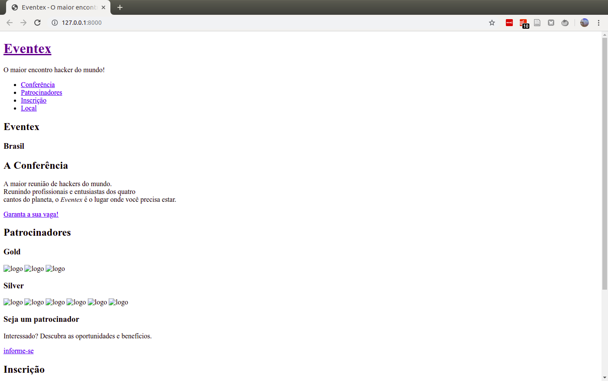
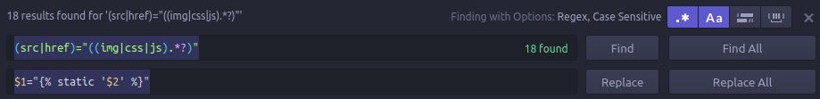

# M1A26: A landing page - https://welcometothedjango.com.br/?post_type=aula&p=936

Baixando o pacote zip que nosso amigo design preparou.

```bash
pwd
cd my_project
pwd
wget https://welcometothedjango.com.br/wp-content/uploads/2015/12/landingpage.zip
unzip landingpage.zip
```

Importando template para o projeto.

```bash
pwd
mkdir -p eventex/core/static
mv -t eventex/core/static landingpage/css landingpage/fonts/ landingpage/img landingpage/js
mv -t eventex/core/templates landingpage/index.html
```

Após a importação, vá até o terminal, ative o projeto e rode o servidor:

```bash
pwd
source .my_project/bin/activate
manage runserver
```

A página é exibida, mas sem aplicação de estilos.



Observe os erros no terminal.

```
June 27, 2019 - 23:27:51
Django version 2.2.2, using settings 'eventex.settings'
Starting development server at http://127.0.0.1:8000/
Quit the server with CONTROL-C.
[27/Jun/2019 23:27:56] "GET / HTTP/1.1" 200 6040
Not Found: /css/font-awesome.min.css
[27/Jun/2019 23:27:56] "GET /css/font-awesome.min.css HTTP/1.1" 404 2112
Not Found: /css/basalstyle/style.min.css
Not Found: /css/main.css
[27/Jun/2019 23:27:56] "GET /css/main.css HTTP/1.1" 404 2076
Not Found: /js/jquery-1.11.0.min.js
[27/Jun/2019 23:27:56] "GET /js/jquery-1.11.0.min.js HTTP/1.1" 404 2109
[27/Jun/2019 23:27:56] "GET /css/basalstyle/style.min.css HTTP/1.1" 404 2124
Not Found: /js/jquery.stellar.min.js
Not Found: /js/retina-1.1.0.min.js
[27/Jun/2019 23:27:56] "GET /js/retina-1.1.0.min.js HTTP/1.1" 404 2106
Not Found: /js/smooth-scroll.js
[27/Jun/2019 23:27:56] "GET /js/jquery.stellar.min.js HTTP/1.1" 404 2112
Not Found: /js/main.js
[27/Jun/2019 23:27:56] "GET /js/main.js HTTP/1.1" 404 2070
[27/Jun/2019 23:27:56] "GET /js/smooth-scroll.js HTTP/1.1" 404 2097
Not Found: /img/sponsor-gold-02.png
[27/Jun/2019 23:27:56] "GET /img/sponsor-gold-02.png HTTP/1.1" 404 2109
Not Found: /img/sponsor-gold-01.png
[27/Jun/2019 23:27:56] "GET /img/sponsor-gold-01.png HTTP/1.1" 404 2109
Not Found: /css/font-awesome.min.css
[27/Jun/2019 23:27:57] "GET /css/font-awesome.min.css HTTP/1.1" 404 2112
Not Found: /img/sponsor-gold-03.png
[27/Jun/2019 23:27:57] "GET /img/sponsor-gold-03.png HTTP/1.1" 404 2109
Not Found: /img/sponsor-silver-01.png
[27/Jun/2019 23:27:57] "GET /img/sponsor-silver-01.png HTTP/1.1" 404 2115
Not Found: /js/jquery-1.11.0.min.js
[27/Jun/2019 23:27:57] "GET /js/jquery-1.11.0.min.js HTTP/1.1" 404 2109
Not Found: /img/sponsor-silver-02.png
[27/Jun/2019 23:27:57] "GET /img/sponsor-silver-02.png HTTP/1.1" 404 2115
Not Found: /img/sponsor-silver-03.png
[27/Jun/2019 23:27:57] "GET /img/sponsor-silver-03.png HTTP/1.1" 404 2115
Not Found: /img/sponsor-silver-04.png
[27/Jun/2019 23:27:57] "GET /img/sponsor-silver-04.png HTTP/1.1" 404 2115
Not Found: /js/jquery.stellar.min.js
[27/Jun/2019 23:27:57] "GET /js/jquery.stellar.min.js HTTP/1.1" 404 2112
Not Found: /img/sponsor-silver-05.png
[27/Jun/2019 23:27:57] "GET /img/sponsor-silver-05.png HTTP/1.1" 404 2115
Not Found: /img/sponsor-silver-06.png
[27/Jun/2019 23:27:57] "GET /img/sponsor-silver-06.png HTTP/1.1" 404 2115
Not Found: /js/smooth-scroll.js
[27/Jun/2019 23:27:57] "GET /js/smooth-scroll.js HTTP/1.1" 404 2097
Not Found: /js/retina-1.1.0.min.js
[27/Jun/2019 23:27:57] "GET /js/retina-1.1.0.min.js HTTP/1.1" 404 2106
Not Found: /js/main.js
[27/Jun/2019 23:27:57] "GET /js/main.js HTTP/1.1" 404 2070
```

É necessário incluir as baterias nessa landingpage. O primeiro passo é editar o cabeçalho do arquivo `template/index.html` e incluir logo na primeira linha: ``. Isso informa onde estão os arquivos de estilo. O segundo passo é substituir a referência dos arquivos de estilo pelo *find and replace* do seu editor de texto. Expressões regulares ajudam a substituir os caminhos, minimizando tanto os erros quanto o trabalho manual.

A expressão utilizada para a busca será:

```
(src|href)="((img|css|js).*?)"
```

E para a substituição será:

```
$1=""
```

Ao todo, foram encontrados 18 caminhos para serem substituídos.



A página agora deve renderizar todos os estilos.
