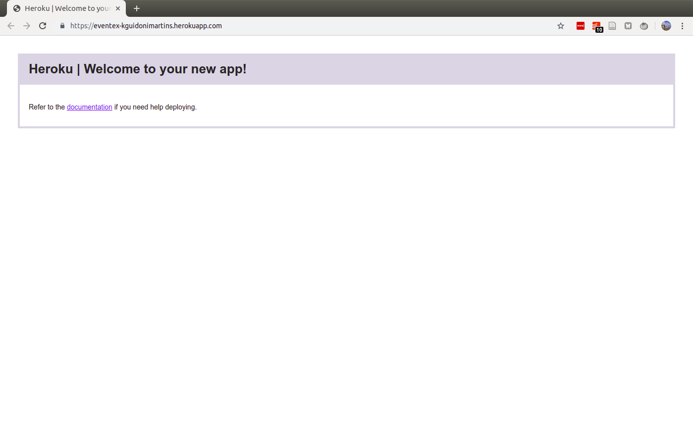

# M1A28: O primeiro deploy a gente nunca esquece - https://welcometothedjango.com.br/?post_type=aula&p=938

Necessidade de separar o que é do projeto e o que é da instância. Quem facilita essa separação é o `python-decouple`. Com o `virtual-env` ativo, instale:

```bash
pip install python-decouple
pip install dj-database-url
pip install dj-static
```

## Pegue as alterações com o [commit](https://github.com/kguidonimartins/wttd/commit/eba873ee8ea8a16bea1e1be249ba588766fddc32) desse arquivo.

Nota¹: a SECRET_KEY dentro do arquivo `.env` não pode conter espaço nem aspas.

Nota²: sqlite3 para desenvolvimento e postgresql para produção

Nota³: entrada do 'gunicorn==19.8.1' e  do 'psycopg2==2.7.4' no requirements.txt sem o uso do `pip`. Essas bibliotecas serão utilizadas somente em produção. Além disso, elas podem exigir outras dependências não prontamente disponíveis pelo sistema operacional.

## Instalação do git na pasta

Somente arquivos-fonte serão versionados. Arquivos gerados dinamicamente, não.

Vai no `.gitignore`:

```
.env
.idea
.my_project
*.sqlite3
*pyc
__pycache__
landingpage.zip
```

## Add e commit do projeto

Primeiro commit do `.gitignore`. Depois commit do resto do projeto.

## Push do projeto pelo heroku CLI

```bash
heroku apps:create eventex-kguidonimartins
```

## Checagens

A primeira checagem é se o git reconhece o heroku como repositório.

```bash
git remove -v
# heroku	https://git.heroku.com/eventex-kguidonimartins.git (fetch)
# heroku	https://git.heroku.com/eventex-kguidonimartins.git (push)
```

A segunda checagem é abrir a aplicação.

```bash
heroku open
```



## Configuração do ambiente de produção

Primeiro a secret key

```bash
heroku config:set SECRET_KEY='f1zhoutybyd@2)g3df^d3tne3+k5*7y2tb&&p4svp$l3c_4f^n'
```

Agora o debug

```bash
heroku config:set DEBUG=True
```

## Deploy do projeto

```bash
git push heroku master --force
```

## Checando online

```bash
heroku open
```

## Links

App: https://eventex-kguidonimartins.herokuapp.com/
Repositório: https://github.com/kguidonimartins/app-eventex-wttd
