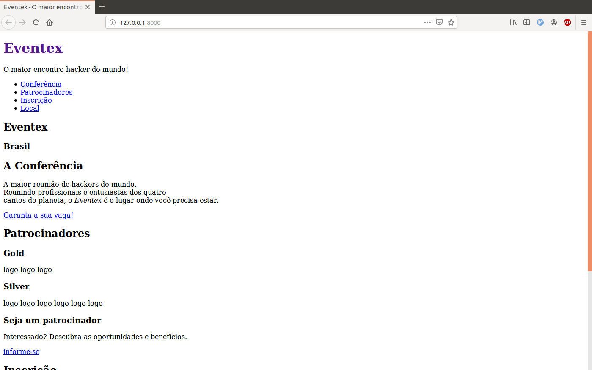
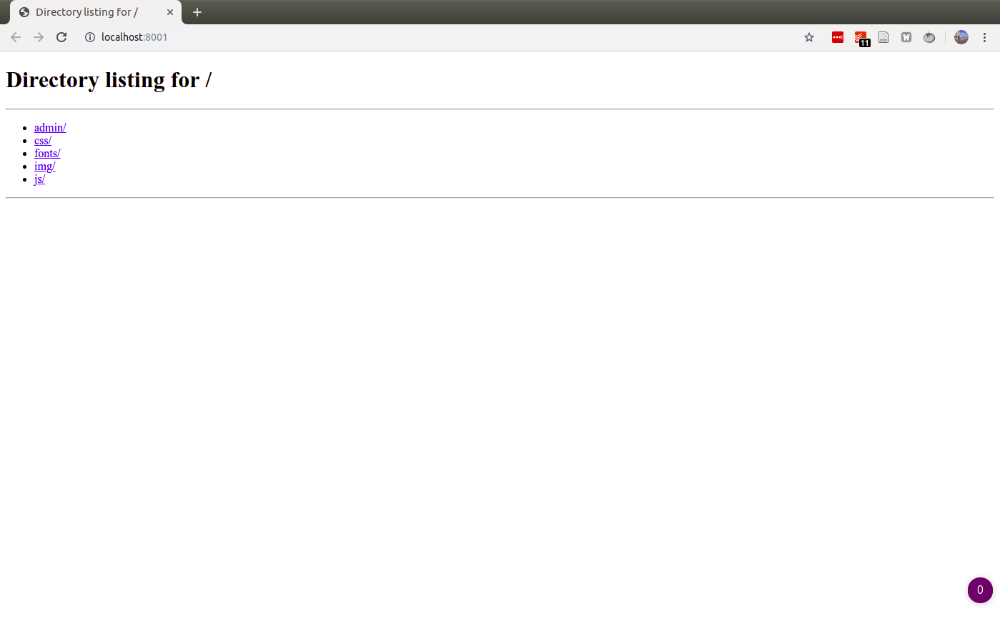
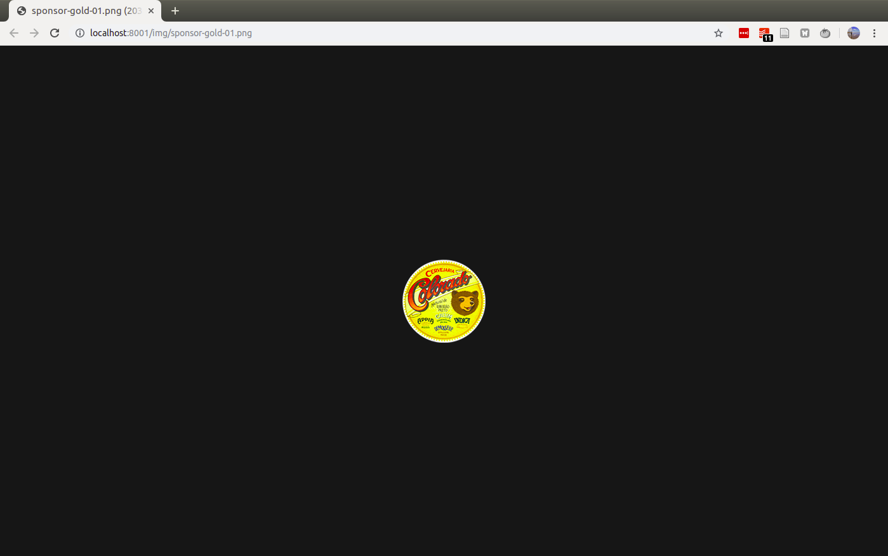
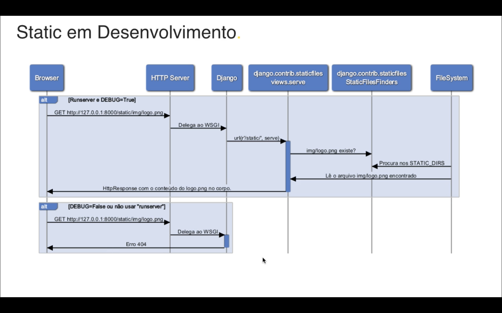
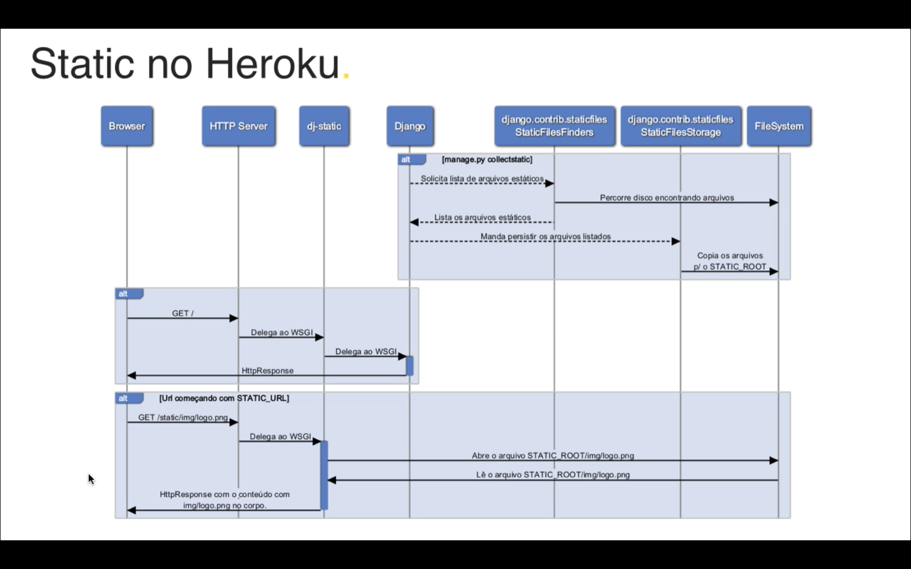
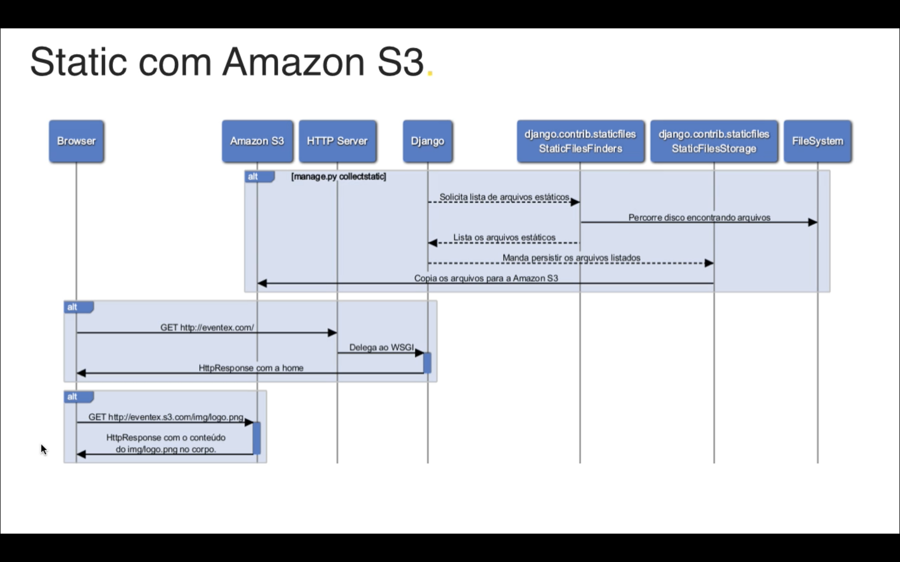

# M2A04: Como trabalhar com arquivos estáticos - https://welcometothedjango.com.br/?post_type=aula&p=1100

Diferença entre *static* e *media*.

- *static*: fazem parte do código fonte do projeto; entra no sistema somente quando o **programador** faz o **deploy**
    - css
    - javascript
    - fontes
    - imagens fixas no código como logos ícones, etc.

- *media*: arquivos enviados ao sistema pelo usuário; entra no sistema quando o **usuário** faz **upload**
    - foto de perfil
    - planilhas
    - arquivos zip
    - vídeos, etc.
    - todo tipo de anexo feito pelo usuário via upload

Acesse o ambiente de desenvolvimento.

```bash
pwd
cd my_project
source .my_project/bin/activate
manage.py runserver
```

Cancele e acesse com `DEBUG=False`

```bash
DEBUG=False manage.py runserver
```



Era esperado que o site fosse exibido sem os arquivos estáticos de estilo. No entanto, o site foi exibido normalmente. Inclusive, a pasta `/staticfiles/` que foi criada na sessão anterior foi apagada e o site continua servindo normalmente. Vou seguir com a prática assim mesmo.

Varrendo os diretórios com arquivos estáticos e copiando.

```bash
manage.py collectstatic
ls staticfiles
ls staticfiles/admin
DEBUG=False manage.py runserver
```

## Experimento desligando o `dj-static` que está servindo os arquivos

Primeiro, ignoramos o `staticfiles`.

```bash
echo "staticfiles" >> .gitignore
```

Editar o comando `application = Cling(get_wsgi_application())` no arquivo `eventex/wsgi.py`, para `application = get_wsgi_application()`.

Servir o site novamente.

```bash
DEBUG=False manage.py runserver
```

Em outro terminal, acesse:

```bash
pwd
cd staticfiles
python -m http.server 8001
```

Acesse no navegador: http://localhost:8001



Deixe o localhost:8001 rodando e edite o arquivo `eventex/settings.py`, trocando `STATIC_URL = '/static/'` por `STATIC_URL = 'http://localhost:8001/'`.

Acesse o site:

```bash
DEBUG=False manage.py runserver
```

Abra uma imagem qualquer da página em outra aba e repare que a *url* agora usa `localhost:8001/img/sponsor-gold-01.png`, por exemplo.



Esse localhost poderia ser outro endereço web (AWS, por exemplo). Repare a saída dos dois terminais. O primeiro é aquele no qual o site foi servido.

```
Performing system checks...

System check identified no issues (0 silenced).

You have 17 unapplied migration(s). Your project may not work properly until you apply the migrations for app(s): admin, auth, contenttypes, sessions.
Run 'python manage.py migrate' to apply them.

June 29, 2019 - 21:00:35
Django version 2.2.2, using settings 'eventex.settings'
Starting development server at http://127.0.0.1:8000/
Quit the server with CONTROL-C.
[29/Jun/2019 21:00:38] "GET / HTTP/1.1" 200 6438
[29/Jun/2019 21:07:56] "GET / HTTP/1.1" 200 6438
```

O segundo é aquele que serviu o diretório 'staticfiles' no localhost:8001

```
127.0.0.1 - - [29/Jun/2019 17:51:08] "GET / HTTP/1.1" 200 -
127.0.0.1 - - [29/Jun/2019 17:51:10] code 404, message File not found
127.0.0.1 - - [29/Jun/2019 17:51:10] "GET /favicon.ico HTTP/1.1" 404 -
127.0.0.1 - - [29/Jun/2019 17:52:08] "GET / HTTP/1.1" 200 -
127.0.0.1 - - [29/Jun/2019 17:52:09] code 404, message File not found
127.0.0.1 - - [29/Jun/2019 17:52:09] "GET /favicon.ico HTTP/1.1" 404 -
127.0.0.1 - - [29/Jun/2019 17:53:45] "GET /admin/ HTTP/1.1" 200 -
127.0.0.1 - - [29/Jun/2019 17:53:48] "GET /admin/css/ HTTP/1.1" 200 -
127.0.0.1 - - [29/Jun/2019 17:53:50] "GET /admin/css/changelists.css HTTP/1.1" 200 -
127.0.0.1 - - [29/Jun/2019 17:54:05] "GET /img/ HTTP/1.1" 200 -
127.0.0.1 - - [29/Jun/2019 17:54:13] "GET /img/top-bg.jpg HTTP/1.1" 200 -
127.0.0.1 - - [29/Jun/2019 17:54:59] "GET /img/register-bg.jpg HTTP/1.1" 200 -
127.0.0.1 - - [29/Jun/2019 18:00:38] "GET /css/font-awesome.min.css HTTP/1.1" 200 -
127.0.0.1 - - [29/Jun/2019 18:00:38] "GET /css/basalstyle/style.min.css HTTP/1.1" 200 -
127.0.0.1 - - [29/Jun/2019 18:00:38] "GET /css/main.css HTTP/1.1" 200 -
127.0.0.1 - - [29/Jun/2019 18:00:38] "GET /js/jquery-1.11.0.min.js HTTP/1.1" 200 -
127.0.0.1 - - [29/Jun/2019 18:00:38] "GET /js/jquery.stellar.min.js HTTP/1.1" 200 -
127.0.0.1 - - [29/Jun/2019 18:00:38] "GET /js/smooth-scroll.js HTTP/1.1" 200 -
127.0.0.1 - - [29/Jun/2019 18:00:38] "GET /js/retina-1.1.0.min.js HTTP/1.1" 200 -
```

Finalize os processos nos terminais e volte ao terminal que estava servindo o site. Adicione as mudanças feitas no `.gitignore`.

```bash
git status
git add .gitignore
git status
git commit -m "Ignora staticfiles"
git status
```

Antes de desfazer as mudanças nos arquivos `eventex/settings.py` e `eventex/wsgi.py`, vou colar abaixo as modificações feitas neles por motivos didáticos. Usei o comando `git diff`. Como saída obtive:

```bash
diff --git a/eventex/settings.py b/eventex/settings.py
index 96ab98c..519021c 100644
--- a/eventex/settings.py
+++ b/eventex/settings.py
@@ -121,5 +121,5 @@ USE_TZ = True
 # Static files (CSS, JavaScript, Images)
 # https://docs.djangoproject.com/en/2.2/howto/static-files/

-STATIC_URL = '/static/'
+STATIC_URL = 'http://localhost:8001/'
 STATIC_ROOT = os.path.join(BASE_DIR, 'staticfiles')


diff --git a/eventex/wsgi.py b/eventex/wsgi.py
index d74e336..efe4e0e 100644
--- a/eventex/wsgi.py
+++ b/eventex/wsgi.py
@@ -13,4 +13,5 @@ from django.core.wsgi import get_wsgi_application

 os.environ.setdefault('DJANGO_SETTINGS_MODULE', 'eventex.settings')

-application = Cling(get_wsgi_application())
+# application = Cling(get_wsgi_application())
+application = get_wsgi_application()
```

Agora, as modificações nesses dois arquivos serão desfeitas com:

```bash
git status
git checkout -- eventex/settings.py eventex/wsgi.py
git status
git push origin master
```

Mandei para meu repositório no github, mas esse passo não foi feito na aula.

## Como os arquivos são servidos



***



***



## Colocando staticfiles na Amazon S3

<!--


TODO: Servir arquivos estátivos usando Amazon S3
BODY: Ainda não consegui usar isso. Fiz algo errado na Amazon e me foi cobrado R$ 4,23. As imagens da minha tentativa frustrada estão em: modulo_02/img/try-set-s3/


 -->
