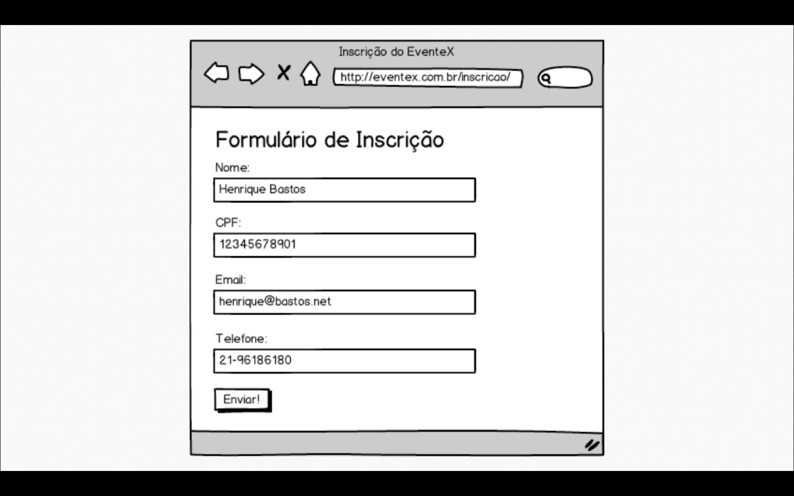

# M2A12: Como faremos as inscrições? - https://welcometothedjango.com.br/?post_type=aula&p=1108

<!--
TODO: Rever o vídeo e documentar todo o processo
BODY: Muitos arquivos foram editados durante essa aula. Seria interessante revê-la e documentar tudo, do início ao fim.
 -->
 


Criação da app `./my_project/eventex/subscriptions` para gerenciamento das inscrições. Um novo pacote python (um novo diretório com o arquivo `__init__.py`) será adicionado à pasta `./my_project/eventex`. A app `subscriptions` também será adicionada à lista de apps (`INSTALLED_APPS`) do arquivo `eventex/settings.py`.

A implementação dessa nova app começa com testes. Confira o conteúdo em `./my_project/subscriptions/tests.py`.

Download do arquivo html com o formulário.

```bash
wget https://welcometothedjango.com.br/wp-content/uploads/2015/12/subscription_form.zip && unzip subscription_form.html
```
