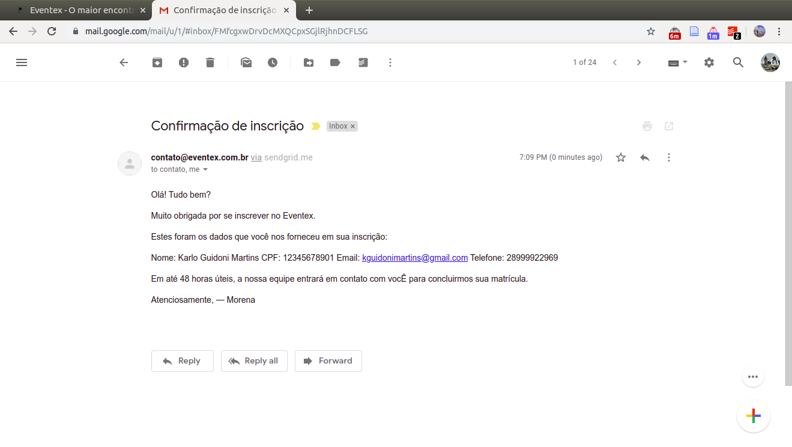
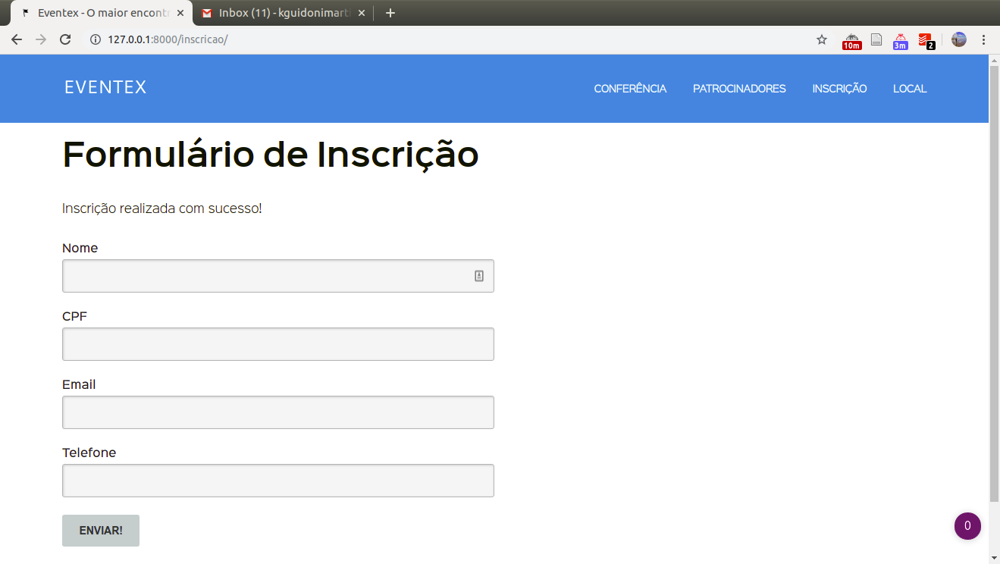

# M2A13: Como sei quem se inscreveu? - https://welcometothedjango.com.br/?post_type=aula&p=1109

- Implementação de um sistema de e-mails automáticos pelo heroku
- Customização da página do formulário
- Conexão do formulário com a página principal

<!--
TODO:
Por segurança, os arquivos finais dessa aula foram copiados para a pasta bkp temporariamente enquando reassisto a aula e refaço todas as modificações. Os arquivos salvos são:

my_project/eventex/subscriptions/templates/subscriptions/subscription_email_bkp.txt
my_project/eventex/subscriptions/templates/subscriptions/subscription_form_bkp.html
my_project/eventex/subscriptions/tests_bkp.py
my_project/eventex/subscriptions/views_bkp.py
my_project/eventex/settings_bkp.py

Agora, eu vou desfazer as modificações nos arquivos originais para conseguir dar continuidade à aula. Isso foi necessário porque os testes do django não iriam falhar uma vez que o código todo estava coberto por testes.
-->

## Definição do escopo do trabalho


Aqui, todas as novas funções serão implementadas usando TDD.

## Submissão do formulário

Criação do teste de submissão do formulário. Edição do arquivo `my_project/eventex/subscriptions/tests.py`.

```python
class SubscribePostTest(TestCase):
    def test_post(self):
        """Valid POST shoud redirect to /inscricao/"""
        data = dict(
            name = 'Henrique Bastos',
            cpf = '12345678901',
            email = 'henrique@bastos.net',
            phone = '21-99618-6180'
        )
        response = self.client.post('/inscricao/', data)
        self.assertEqual(302, response.status_code)
```

Os dados do dicionário vão simular as informações preenchidas no formulário e o assert vai testar o redirecionamento do "inscrito" para a própria página de inscrição. Isso funciona como se o usuário recebesse uma mensagem de "Sua inscrição foi efetuada com sucesso". Essa característica será implementada adiante.

Testando:

```bash
cd my_project
source .my_project/bin/activate
manage test
```

Resultado:

```
Creating test database for alias 'default'...
System check identified no issues (0 silenced).
..F......
======================================================================
FAIL: test_post (eventex.subscriptions.tests.SubscribePostTest)
Valid POST shoud redirect to /inscricao/
----------------------------------------------------------------------
Traceback (most recent call last):
  File "/home/karlo/GoogleDrive2/git-repos/wttd/my_project/eventex/subscriptions/tests.py", line 50, in test_post
    self.assertEqual(302, response.status_code)
AssertionError: 302 != 200

----------------------------------------------------------------------
Ran 9 tests in 0.080s

FAILED (failures=1)
Destroying test database for alias 'default'...
```

A expectativa do teste não foi atendida. Isso aconteceu porque somente o GET foi implementado. A implementação do POST será feita no arquivo `my_project/eventex/subscriptions/views.py`.

```python
from django.http import HttpResponseRedirect


def subscribe(request):
    if request.method == 'POST':
        return HttpResponseRedirect('/inscricao/')

    else:
        context = {'form': SubscriptionForm()}
        return render(request, 'subscriptions/subscription_form.html', context)
```

Testando a nova edição:

```bash
manage test
```

Resultado:

```
Creating test database for alias 'default'...
System check identified no issues (0 silenced).
.........
----------------------------------------------------------------------
Ran 9 tests in 0.092s

OK
Destroying test database for alias 'default'...
```

Teste passando. Agora o teste pode ser refatorado com a inclusão do método `setUp`. Voltando ao arquivo `my_project/eventex/subscriptions/test.py`

```python
class SubscribePostTest(TestCase):
    def setUp(self):
        data = dict(
            name = 'Henrique Bastos',
            cpf = '12345678901',
            email = 'henrique@bastos.net',
            phone = '21-99618-6180'
        )
        self.resp = self.client.post('/inscricao/', data)

    def test_post(self):
        """Valid POST shoud redirect to /inscricao/"""
        self.assertEqual(302, self.resp.status_code)
```

Testando:

```bash
manage test
```

Resultado:

```
Creating test database for alias 'default'...
System check identified no issues (0 silenced).
.........
----------------------------------------------------------------------
Ran 9 tests in 0.059s

OK
Destroying test database for alias 'default'...
```

O teste continua passando. Agora o objetivo é implementar o teste de envio de e-mail. Novamente, edição do arquivo `my_project/eventex/subscriptions/test.py`:

```python
from django.core import mail

def test_send_subscribe_email(self):
    self.assertEqual(1, len(mail.outbox))
```

Quando o django está em modo de teste, ele não envia e-mails de verdade. Ele usa o método `mail` para contar quantos em e-mails foram enviados. Assim, quando o POST for executado, pelo menos um e-mail deve ser enviado. Testando:

```bash
manage test
```

Resultado:

```
Creating test database for alias 'default'...
System check identified no issues (0 silenced).
...F......
======================================================================
FAIL: test_send_subscribe_email (eventex.subscriptions.tests.SubscribePostTest)
----------------------------------------------------------------------
Traceback (most recent call last):
  File "/home/karlo/GoogleDrive2/git-repos/wttd/my_project/eventex/subscriptions/tests.py", line 56, in test_send_subscribe_email
    self.assertEqual(1, len(mail.outbox))
AssertionError: 1 != 0

----------------------------------------------------------------------
Ran 10 tests in 0.061s

FAILED (failures=1)
Destroying test database for alias 'default'...
```

Testando falhando porque o envio de e-mail ainda não foi implementado. Isso será feito no arquivo `my_project/eventex/subscriptions/views.py`

```python
from django.core import mail

def subscribe(request):
    if request.method == 'POST':

        mail.send_mail(
            'Subject',
            'Message',
            'sender@email.com',
            ['visitor@email.com']
        )

        return HttpResponseRedirect('/inscricao/')

    else:
        context = {'form': SubscriptionForm()}
        return render(request, 'subscriptions/subscription_form.html', context)
```

Testando:

```bash
manage test
```

Resultado:

```
Creating test database for alias 'default'...
System check identified no issues (0 silenced).
..........
----------------------------------------------------------------------
Ran 10 tests in 0.070s

OK
Destroying test database for alias 'default'...
```

Agora o fluxo de envio de e-mail está funcionando, mas a formatação/mensagem do e-mail ainda não. Para isso, será implementando um teste para cada parte do e-mail (assunto, destinatário, remetente e mensagem) no arquivo `my_project/eventex/subscriptions/tests.py`:

```python
def test_subscription_email_subject(self):
    email = mail.outbox[0]
    expect = 'Confirmação de inscrição'

    self.assertEqual(expect, email.subject)
```

Testando:

```bash
manage test
```

Resultado:

```
Creating test database for alias 'default'...
System check identified no issues (0 silenced).
....F......
======================================================================
FAIL: test_subscription_email_subject (eventex.subscriptions.tests.SubscribePostTest)
----------------------------------------------------------------------
Traceback (most recent call last):
  File "/home/karlo/GoogleDrive2/git-repos/wttd/my_project/eventex/subscriptions/tests.py", line 62, in test_subscription_email_subject
    self.assertEqual(expect, email.subject)
AssertionError: 'Confirmação de inscrição' != 'Subject'
- Confirmação de inscrição
+ Subject


----------------------------------------------------------------------
Ran 11 tests in 0.077s

FAILED (failures=1)
Destroying test database for alias 'default'...
```

Teste falhando porque 'Confirmação de inscrição' não faz parte daquilo que foi implementado no arquivo `views.py`. Para resolver, 'Subject' será substituído por 'Confirmação de inscrição' no arquivo `my_project/eventex/subscriptions/views.py`:

```python
def subscribe(request):
    if request.method == 'POST':

        mail.send_mail(
            'Confirmação de inscrição',
            'Message',
            'sender@email.com',
            ['visitor@email.com']
        )

        return HttpResponseRedirect('/inscricao/')

    else:
        context = {'form': SubscriptionForm()}
        return render(request, 'subscriptions/subscription_form.html', context)
```

Testando:

```bash
manage test
```

Resultado:

```
Creating test database for alias 'default'...
System check identified no issues (0 silenced).
...........
----------------------------------------------------------------------
Ran 11 tests in 0.072s

OK
Destroying test database for alias 'default'...
```

Teste passando. Agora o teste para remetente será implementado:

```python
def test_subscription_email_from(self):
    email = mail.outbox[0]
    expect = 'contato@eventex.com.br'

    self.assertEqual(expect, email.from_email)
```

Testando:

```bash
manage test
```

Resultado:

```
Creating test database for alias 'default'...
System check identified no issues (0 silenced).
....F.......
======================================================================
FAIL: test_subscription_email_from (eventex.subscriptions.tests.SubscribePostTest)
----------------------------------------------------------------------
Traceback (most recent call last):
  File "/home/karlo/GoogleDrive2/git-repos/wttd/my_project/eventex/subscriptions/tests.py", line 68, in test_subscription_email_from
    self.assertEqual(expect, email.from_email)
AssertionError: 'contato@eventex.com.br' != 'sender@email.com'
- contato@eventex.com.br
+ sender@email.com


----------------------------------------------------------------------
Ran 12 tests in 0.084s

FAILED (failures=1)
Destroying test database for alias 'default'...
```

Falha parecida com a anterior. O remetente esperado não é aquele que foi implementado no arquivo `views.py`:

```python
def subscribe(request):
    if request.method == 'POST':

        mail.send_mail(
            'Confirmação de inscrição',
            'Message',
            'contato@eventex.com.br',
            ['visitor@email.com']
        )

        return HttpResponseRedirect('/inscricao/')

    else:
        context = {'form': SubscriptionForm()}
        return render(request, 'subscriptions/subscription_form.html', context)
```

Testando:

```bash
manage test
```

Resultado:

```
Creating test database for alias 'default'...
System check identified no issues (0 silenced).
............
----------------------------------------------------------------------
Ran 12 tests in 0.077s

OK
Destroying test database for alias 'default'...
```

Próximo passo: destinatário. Edição do arquivo de testes:

```python
def test_subscription_email_to(self):
    email = mail.outbox[0]
    expect = ['contato@eventex.com.br', 'kguidonimartins@gmail.com']

    self.assertEqual(expect, email.to)
```

Testando:

```bash
manage test
```

Resultado:

```
Creating test database for alias 'default'...
System check identified no issues (0 silenced).
......F......
======================================================================
FAIL: test_subscription_email_to (eventex.subscriptions.tests.SubscribePostTest)
----------------------------------------------------------------------
Traceback (most recent call last):
  File "/home/karlo/GoogleDrive2/git-repos/wttd/my_project/eventex/subscriptions/tests.py", line 74, in test_subscription_email_to
    self.assertEqual(expect, email.to)
AssertionError: Lists differ: ['contato@eventex.com.br', 'kguidonimartins@gmail.com'] != ['visitor@email.com']

First differing element 0:
'contato@eventex.com.br'
'visitor@email.com'

First list contains 1 additional elements.
First extra element 1:
'kguidonimartins@gmail.com'

- ['contato@eventex.com.br', 'kguidonimartins@gmail.com']
+ ['visitor@email.com']

----------------------------------------------------------------------
Ran 13 tests in 0.096s

FAILED (failures=1)
Destroying test database for alias 'default'...
```

A falha informa que o destinatário difere daquele inicialmente configurado, inclusive comparando os elementos da lista um a um. Trocar os destinários na lista da `view.py` deve resolver.

```python
def subscribe(request):
    if request.method == 'POST':

        mail.send_mail(
            'Confirmação de inscrição',
            'Message',
            'contato@eventex.com.br',
            ['contato@eventex.com.br', 'kguidonimartins@gmail.com']
        )

        return HttpResponseRedirect('/inscricao/')

    else:
        context = {'form': SubscriptionForm()}
        return render(request, 'subscriptions/subscription_form.html', context)
```

Os destinários são *hard coded* porque a ideia é testar o fluxo de envio. Testando:

```bash
manage test
```

Resultado:

```
Creating test database for alias 'default'...
System check identified no issues (0 silenced).
.............
----------------------------------------------------------------------
Ran 13 tests in 0.082s

OK
Destroying test database for alias 'default'...
```

Uma vez que o envio está configurado, agora é necessário configurar o conteúdo do corpo do email. Neste caso, o corpo do email deve conter as informações passadas pelo usuário no formulário de inscrição. Edição do arquivo de testes:

```python
def test_subscription_email_body(self):
    email = mail.outbox[0]

    self.assertIn('Karlo Guidoni Martins', email.body)
    self.assertIn('12345678901', email.body)
    self.assertIn('kguidonimartins@gmail.com', email.body)
    self.assertIn('28-9-9992-2969', email.body)
```

Testando:

```bash
manage test
```

Resultado:

```
Creating test database for alias 'default'...
System check identified no issues (0 silenced).
....F.........
======================================================================
FAIL: test_subscription_email_body (eventex.subscriptions.tests.SubscribePostTest)
----------------------------------------------------------------------
Traceback (most recent call last):
  File "/home/karlo/GoogleDrive2/git-repos/wttd/my_project/eventex/subscriptions/tests.py", line 79, in test_subscription_email_body
    self.assertIn('Karlo Guidoni Martins', email.body)
AssertionError: 'Karlo Guidoni Martins' not found in 'Message'

----------------------------------------------------------------------
Ran 14 tests in 0.075s

FAILED (failures=1)
Destroying test database for alias 'default'...
```

É preciso inserir uma mensagem ao corpo do email no arquivo `view.py`. Essa mensagem, por enquanto, será anexada ao final do arquivo como uma constante. O arquivo `view.py` ficará assim:

```python
from django.core import mail
from django.shortcuts import render
from django.http import HttpResponseRedirect
from eventex.subscriptions.forms import SubscriptionForm

def subscribe(request):
    if request.method == 'POST':

        mail.send_mail(
            'Confirmação de inscrição',
            MESSAGE,
            'contato@eventex.com.br',
            ['contato@eventex.com.br', 'kguidonimartins@gmail.com']
        )

        return HttpResponseRedirect('/inscricao/')

    else:
        context = {'form': SubscriptionForm()}
        return render(request, 'subscriptions/subscription_form.html', context)


MESSAGE = """
Olá! Tudo bem?

Muito obrigada por se inscrever no Eventex.

Estes foram os dados que você nos forneceu
em sua inscrição:

Nome: Karlo Guidoni Martins
CPF: 12345678901
Email: kguidonimartins@gmail.com
Telefone: 28-9-9992-2969

Em até 48 horas úteis, a nossa equipe entrará
em contato com vocÊ para concluirmos sua matrícula.

Atenciosamente,
--
Morena
"""
```

Testando:

```bash
manage test
```

Resultado:

```
Creating test database for alias 'default'...
System check identified no issues (0 silenced).
..............
----------------------------------------------------------------------
Ran 14 tests in 0.088s

OK
Destroying test database for alias 'default'...
```

Teste passando. No entanto, essa mensagem de email hospedada dentro do código fonte da aplicação não parece adequado. O ideal seria ter um template de email em arquivo de texto que pudesse ser ligado à mensagem de email. Para isso, o arquivo `my_project/eventex/subscriptions/templates/subscriptions/subscription_email.txt` será criado. Ele terá a mesma mensagem que foi anexada na `view.py` como constante. Vale lembrar que a mensagem na `view.py` será apagada.

Conteúdo do arquivo `my_project/eventex/subscriptions/templates/subscriptions/subscription_email.txt`:

```
Olá! Tudo bem?

Muito obrigada por se inscrever no Eventex.

Estes foram os dados que você nos forneceu
em sua inscrição:

Nome: {{ name }}
CPF: {{ cpf }}
Email: {{ email }}
Telefone: {{ phone }}

Em até 48 horas úteis, a nossa equipe entrará
em contato com vocÊ para concluirmos sua matrícula.

Atenciosamente,
--
Morena
```

As variáveis dentro das `{{ }}` capturam os dados do usuário após o preenchimento do formulário. Agora, é necessário passar esse template para a `view.py`. O arquivo ficará assim:

```python
from django.core import mail
from django.shortcuts import render
from django.template.loader import render_to_string
from django.http import HttpResponseRedirect
from eventex.subscriptions.forms import SubscriptionForm

def subscribe(request):
    if request.method == 'POST':
        context = dict(
            name = 'Karlo Guidoni Martins',
            cpf = '12345678901',
            email = 'kguidonimartins@gmail.com',
            phone = '28-9-9992-2969'
        )

        body = render_to_string(
            'subscriptions/subscription_email.txt',
            context
        )

        mail.send_mail(
            'Confirmação de inscrição',
            body,
            'contato@eventex.com.br',
            ['contato@eventex.com.br', 'kguidonimartins@gmail.com']
        )

        return HttpResponseRedirect('/inscricao/')

    else:
        context = {'form': SubscriptionForm()}
        return render(request, 'subscriptions/subscription_form.html', context)
```

Testando:

```bash
manage test
```

Resultado:

```
Creating test database for alias 'default'...
System check identified no issues (0 silenced).
..............
----------------------------------------------------------------------
Ran 14 tests in 0.084s

OK
Destroying test database for alias 'default'...
```

Agora, falta conectar o que é a passado para o formulário com o POST com a `view.py`. Isso é feito assim:

```python
def subscribe(request):
    if request.method == 'POST':
        form = SubscriptionForm(request.POST)
        form.full_clean()

        body = render_to_string(
            'subscriptions/subscription_email.txt',
            form.cleaned_data
        )

        mail.send_mail(
            'Confirmação de inscrição',
            body,
            'contato@eventex.com.br',
            ['contato@eventex.com.br', form.cleaned_data['email']]
        )

        return HttpResponseRedirect('/inscricao/')

    else:
        context = {'form': SubscriptionForm()}
        return render(request, 'subscriptions/subscription_form.html', context)
```

Testando a modificação:

```bash
manage test
```

Resultado:

```
Creating test database for alias 'default'...
System check identified no issues (0 silenced).
..............
----------------------------------------------------------------------
Ran 14 tests in 0.087s

OK
Destroying test database for alias 'default'...
```

O cenário de sucesso está pronto. O próximo passo é construir o cenário no qual o usuário não preenche todas as informações necessárias. A construção desse cenário começa com o teste. Edição do arquivo `eventex/subscriptions/tests.py`

```python
class SubscribeInvalidPost(TestCase):
    def test_post(self):
        """Invalid POST should not redirect"""
        response = self.client.post('/inscricao/', {})
        self.assertEqual(200, response.status_code)
```

Testando:

```bash
manage test
```

Resultado:

```
Creating test database for alias 'default'...
System check identified no issues (0 silenced).
..E............
======================================================================
ERROR: test_post (eventex.subscriptions.tests.SubscribeInvalidPost)
Invalid POST should not redirect
----------------------------------------------------------------------
Traceback (most recent call last):
  File "/home/karlo/GoogleDrive2/git-repos/wttd/my_project/eventex/subscriptions/tests.py", line 88, in test_post
    response = self.client.post('/inscricao/', {})
  File "/home/karlo/.pyenv/versions/3.7.4/lib/python3.7/site-packages/django/test/client.py", line 543, in post
    response = super().post(path, data=data, content_type=content_type, secure=secure, **extra)
  File "/home/karlo/.pyenv/versions/3.7.4/lib/python3.7/site-packages/django/test/client.py", line 357, in post
    secure=secure, **extra)
  File "/home/karlo/.pyenv/versions/3.7.4/lib/python3.7/site-packages/django/test/client.py", line 422, in generic
    return self.request(**r)
  File "/home/karlo/.pyenv/versions/3.7.4/lib/python3.7/site-packages/django/test/client.py", line 503, in request
    raise exc_value
  File "/home/karlo/.pyenv/versions/3.7.4/lib/python3.7/site-packages/django/core/handlers/exception.py", line 34, in inner
    response = get_response(request)
  File "/home/karlo/.pyenv/versions/3.7.4/lib/python3.7/site-packages/django/core/handlers/base.py", line 115, in _get_response
    response = self.process_exception_by_middleware(e, request)
  File "/home/karlo/.pyenv/versions/3.7.4/lib/python3.7/site-packages/django/core/handlers/base.py", line 113, in _get_response
    response = wrapped_callback(request, *callback_args, **callback_kwargs)
  File "/home/karlo/GoogleDrive2/git-repos/wttd/my_project/eventex/subscriptions/views.py", line 21, in subscribe
    ['contato@eventex.com.br', form.cleaned_data['email']]
KeyError: 'email'

----------------------------------------------------------------------
Ran 15 tests in 0.113s

FAILED (errors=1)
Destroying test database for alias 'default'...
```

O teste busca a informação sobre o email dentro da `view.py` e não encontra. Isso acontece porque o fluxo da `view.py` foi pensado para o cenário de sucesso, com as informações já limpa fornecidas pelo `form.full_clean()`. Assim, é preciso mudar o fluxo da `view.py`. O objetivo é verificar primeiro se os dados são válidos.

```python
from django.http import HttpResponseRedirect, HttpResponse

def subscribe(request):
    if request.method == 'POST':
        form = SubscriptionForm(request.POST)

        if form.is_valid():

            body = render_to_string(
                'subscriptions/subscription_email.txt',
                form.cleaned_data
            )

            mail.send_mail(
                'Confirmação de inscrição',
                body,
                'contato@eventex.com.br',
                ['contato@eventex.com.br', form.cleaned_data['email']]
            )

            return HttpResponseRedirect('/inscricao/')
        else:
            return HttpResponse()

    else:
        context = {'form': SubscriptionForm()}
        return render(request, 'subscriptions/subscription_form.html', context)
```

Testando:

```bash
manage test
```

Resultado:

```
Creating test database for alias 'default'...
System check identified no issues (0 silenced).
...............
----------------------------------------------------------------------
Ran 15 tests in 0.110s

OK
Destroying test database for alias 'default'...
```

A ideia agora é que, no caso de dados inválidos informados pelo usuário, o `HttpResponse` retorne o `status_code` 200 e informe que os dados são inválidos, mostrando o formulário com os erros.

Criando um novo teste primeiro:

```python
class SubscribeInvalidPost(TestCase):
    def setUp(self):
        self.resp = self.client.post('/inscricao/', {})

    def test_post(self):
        """Invalid POST should not redirect"""
        self.assertEqual(200, self.resp.status_code)

    def test_template(self):
        self.assertTemplateUsed(self.resp, 'subscription/subscription_form.html')
```

Testando:

```bash
manage test
```

Resultado:

```
Creating test database for alias 'default'...
System check identified no issues (0 silenced).
...F............
======================================================================
FAIL: test_template (eventex.subscriptions.tests.SubscribeInvalidPost)
----------------------------------------------------------------------
Traceback (most recent call last):
  File "/home/karlo/GoogleDrive2/git-repos/wttd/my_project/eventex/subscriptions/tests.py", line 94, in test_template
    self.assertTemplateUsed(self.resp, 'subscription/subscription_form.html')
  File "/home/karlo/.pyenv/versions/3.7.4/lib/python3.7/site-packages/django/test/testcases.py", line 639, in assertTemplateUsed
    self.fail(msg_prefix + "No templates used to render the response")
AssertionError: No templates used to render the response

----------------------------------------------------------------------
Ran 16 tests in 0.105s

FAILED (failures=1)
Destroying test database for alias 'default'...
```

Não existe template sendo renderizado. Isso será resolvido na `view.py`.

```python
def subscribe(request):
    if request.method == 'POST':
        form = SubscriptionForm(request.POST)

        if form.is_valid():

            body = render_to_string(
                'subscriptions/subscription_email.txt',
                form.cleaned_data
            )

            mail.send_mail(
                'Confirmação de inscrição',
                body,
                'contato@eventex.com.br',
                ['contato@eventex.com.br', form.cleaned_data['email']]
            )

            return HttpResponseRedirect('/inscricao/')
        else:
            return render(request, 'subscriptions/subscription_form.html')

    else:
        context = {'form': SubscriptionForm()}
        return render(request, 'subscriptions/subscription_form.html', context)
```

Testando:

```bash
manage test
```

Resultado:

```
Creating test database for alias 'default'...
System check identified no issues (0 silenced).
................
----------------------------------------------------------------------
Ran 16 tests in 0.128s

OK
Destroying test database for alias 'default'...
```

A ideia agora é garantir que o formulário correto esteja no contexto para renderizar o template. Os erros precisam ser exibidos para o usuário. Primeiro o teste tem que garantir a existência do formulário:

```python
class SubscribeInvalidPost(TestCase):
    def setUp(self):
        self.resp = self.client.post('/inscricao/', {})

    def test_post(self):
        """Invalid POST should not redirect"""
        self.assertEqual(200, self.resp.status_code)

    def test_template(self):
        self.assertTemplateUsed(self.resp, 'subscriptions/subscription_form.html')

    def test_has_form(self):
        form = self.resp.context['form']
        self.assertIsInstance(form, SubscriptionForm)
```

Testando:

```bash
manage test
```

Resultado:

```
Creating test database for alias 'default'...
System check identified no issues (0 silenced).
................
----------------------------------------------------------------------
Ran 16 tests in 0.128s

OK
Destroying test database for alias 'default'...
 .my_project  karlo  vostro  ~/…/my_project  master  2✎  2?  $  manage test
Creating test database for alias 'default'...
System check identified no issues (0 silenced).
..E..............
======================================================================
ERROR: test_has_form (eventex.subscriptions.tests.SubscribeInvalidPost)
----------------------------------------------------------------------
Traceback (most recent call last):
  File "/home/karlo/GoogleDrive2/git-repos/wttd/my_project/eventex/subscriptions/tests.py", line 97, in test_has_form
    form = self.resp.context['form']
  File "/home/karlo/.pyenv/versions/3.7.4/lib/python3.7/site-packages/django/template/context.py", line 83, in __getitem__
    raise KeyError(key)
KeyError: 'form'

----------------------------------------------------------------------
Ran 17 tests in 0.121s

FAILED (errors=1)
Destroying test database for alias 'default'...
```

`KeyError` porque não tem nada sendo passado no contexto do render. Isso será resolvido na `view.py`.

```python
def subscribe(request):
    if request.method == 'POST':
        form = SubscriptionForm(request.POST)

        if form.is_valid():

            body = render_to_string(
                'subscriptions/subscription_email.txt',
                form.cleaned_data
            )

            mail.send_mail(
                'Confirmação de inscrição',
                body,
                'contato@eventex.com.br',
                ['contato@eventex.com.br', form.cleaned_data['email']]
            )

            return HttpResponseRedirect('/inscricao/')
        else:
            return render(
                request,
                'subscriptions/subscription_form.html',
                {'form': SubscriptionForm()}
                )

    else:
        context = {'form': SubscriptionForm()}
        return render(request, 'subscriptions/subscription_form.html', context)
```

Testando:

```bash
manage test
```

Resultado:

```
Creating test database for alias 'default'...
System check identified no issues (0 silenced).
.................
----------------------------------------------------------------------
Ran 17 tests in 0.112s

OK
Destroying test database for alias 'default'...
```

No entanto, é preciso garantir também que a instância do formulário passada no contexto do render contenha os erros, que serão processados e informados ao usuário.

```python
class SubscribeInvalidPost(TestCase):
    def setUp(self):
        self.resp = self.client.post('/inscricao/', {})

    def test_post(self):
        """Invalid POST should not redirect"""
        self.assertEqual(200, self.resp.status_code)

    def test_template(self):
        self.assertTemplateUsed(self.resp, 'subscriptions/subscription_form.html')

    def test_has_form(self):
        form = self.resp.context['form']
        self.assertIsInstance(form, SubscriptionForm)

    def test_form_has_errors(self):
        form = self.resp.context['form']
        self.assertTrue(form.errors)
```

Testando:

```bash
manage test
```

Resultado:

```
Creating test database for alias 'default'...
System check identified no issues (0 silenced).
..F...............
======================================================================
FAIL: test_form_has_errors (eventex.subscriptions.tests.SubscribeInvalidPost)
----------------------------------------------------------------------
Traceback (most recent call last):
  File "/home/karlo/GoogleDrive2/git-repos/wttd/my_project/eventex/subscriptions/tests.py", line 102, in test_form_has_errors
    self.assertTrue(form.errors)
AssertionError: {} is not true

----------------------------------------------------------------------
Ran 18 tests in 0.146s

FAILED (failures=1)
Destroying test database for alias 'default'...
```

'AssertionError' porque o está sendo passado na view é o render de formulário vazio, quando na verdade é o formulário válido que deve ser passado, aquele que contém os dados do POST.

```python
from django.core import mail
from django.shortcuts import render
from django.template.loader import render_to_string
from django.http import HttpResponseRedirect, HttpResponse
from eventex.subscriptions.forms import SubscriptionForm

def subscribe(request):
    if request.method == 'POST':
        form = SubscriptionForm(request.POST)

        if form.is_valid():

            body = render_to_string(
                'subscriptions/subscription_email.txt',
                form.cleaned_data
            )

            mail.send_mail(
                'Confirmação de inscrição',
                body,
                'contato@eventex.com.br',
                ['contato@eventex.com.br', form.cleaned_data['email']]
            )

            return HttpResponseRedirect('/inscricao/')
        else:
            return render(
                request,
                'subscriptions/subscription_form.html',
                {'form': form}
                )

    else:
        context = {'form': SubscriptionForm()}
        return render(request, 'subscriptions/subscription_form.html', context)
```

Testando:

```bash
manage test
```

Resultado:

```
Creating test database for alias 'default'...
System check identified no issues (0 silenced).
..................
----------------------------------------------------------------------
Ran 18 tests in 0.145s

OK
Destroying test database for alias 'default'...
```

Hora de visualizar o resultado no site.

```bash
manage runserver
```

Acessando http://127.0.0.1:8000/inscricao/ e clicando em enviar:


O aviso está em inglês. Isso será editado no `eventex/settings.py`, em LANGUAGE_CODE:

```python
LANGUAGE_CODE = 'pt-br'
```

Resultando em:


Preenchendo o formulário e enviado resulta em:


O Django possui um cliente smtp para envio de email, mas em desenvolvimento ele não está ativo. Isso também será resolvido em `eventex/settings.py`. O que precisa ser feito é trocar o backend padrão do Django por outros.

```python
# E-mail configuration
EMAIL_BACKEND = 'django.core.mail.backends.console.EmailBackend'
```

Resultado do console:

```
October 17, 2019 - 08:25:44
Django version 2.2.4, using settings 'eventex.settings'
Starting development server at http://127.0.0.1:8000/
Quit the server with CONTROL-C.
Content-Type: text/plain; charset="utf-8"
MIME-Version: 1.0
Content-Transfer-Encoding: 8bit
Subject: =?utf-8?b?Q29uZmlybWHDp8OjbyBkZSBpbnNjcmnDp8Ojbw==?=
From: contato@eventex.com.br
To: contato@eventex.com.br, kguidonimartins@gmail.com
Date: Thu, 17 Oct 2019 08:25:57 -0000
Message-ID: <157130075776.30838.5476220602927012911@vostro>

Olá! Tudo bem?

Muito obrigada por se inscrever no Eventex.

Estes foram os dados que você nos forneceu
em sua inscrição:

Nome: Karlo Guidoni Martins
CPF: 12345678901
Email: kguidonimartins@gmail.com
Telefone: 28-9-9992-2969

Em até 48 horas úteis, a nossa equipe entrará
em contato com vocÊ para concluirmos sua matrícula.

Atenciosamente,
--
Morena

-------------------------------------------------------------------------------
[17/Oct/2019 08:25:57] "POST /inscricao/ HTTP/1.1" 302 0
[17/Oct/2019 08:25:57] "GET /inscricao/ HTTP/1.1" 200 3586
```

Configurado. Agora é necessário configurar um email no heroku. Mas antes, é preciso definir no `eventex/settings.py` as variáveis de ambiente que serão utilizadas pelo `decouple`.

```python
# E-mail configuration
# EMAIL_BACKEND = 'django.core.mail.backends.console.EmailBackend'
EMAIL_BACKEND = config('EMAIL_BACKEND')
EMAIL_HOST = config('EMAIL_HOST')
EMAIL_PORT = config('EMAIL_PORT', cast=int)
EMAIL_USE_TLS = config('EMAIL_USE_TLS', cast=bool)
EMAIL_HOST_USER = config('EMAIL_HOST_USER')
EMAIL_HOST_PASSWORD = config('EMAIL_HOST_PASSWORD')
```

Essas variáveis precisam ser passadas para o `.env` com algumas edições.

```python
EMAIL_BACKEND=django.core.mail.backends.console.EmailBackend
EMAIL_HOST=localhost
EMAIL_PORT=25
EMAIL_USE_TLS=False
EMAIL_HOST_USER=
EMAIL_HOST_PASSWORD=
```

Isso deve evitar a confusão entre variáveis de ambiente de desenvolvimento e daquelas de deploy.

O envio de email será feito pelo SendGrid do heroku.


O serviço é ativado no seguinte comando no terminal:

```bash
heroku addons:create sendgrid:starter
```

Para ver a documentação:

```bash
heroku addons:docs sendgrid
```

Existe uma opção para envio dos e-mails usando a API do próprio SendGrid. Entretanto, o envio de e-mails do eventex será feito via smtp. Para isso, os valores utlizados serão similares àqueles usados pelas configurações do Ruby. Ver [aqui](https://devcenter.heroku.com/articles/sendgrid#configure-actionmailer-to-use-sendgrid).

```ruby
# Setup the mailer config
 config.action_mailer.delivery_method = :smtp
 config.action_mailer.perform_deliveries = true
 config.action_mailer.smtp_settings = {
   :user_name => ENV['SENDGRID_USERNAME'],
   :password => ENV['SENDGRID_PASSWORD'],
   :domain => 'yourdomain.com',
   :address => 'smtp.sendgrid.net',
   :port => 587,
   :authentication => :plain,
   :enable_starttls_auto => true
 }
```

Os testes serão conduzidos em modo de desenvolvimento, utilizando o SendGrid para enviar os e-mails. Os testes necessitam de variáveis de ambiente presentes no arquivo `.env`. Os valores de `SENDGRID_USERNAME` e `SENDGRID_PASSWORD` podem ser obtidos no terminal usando o comando:

```bash
heroku config
```

O arquivo `.env` deve ficar assim:

```
SECRET_KEY=xxxx
DEBUG=True
ALLOWED_HOSTS=127.0.0.1, .localhost, .herokuapp.com

#EMAIL_BACKEND=django.core.mail.backends.console.EmailBackend
#EMAIL_HOST=localhost
#EMAIL_PORT=25
#EMAIL_USE_TLS=False
#EMAIL_HOST_USER=
#EMAIL_HOST_PASSWORD=

EMAIL_BACKEND=django.core.mail.backends.smtp.EmailBackend
EMAIL_HOST=smtp.sendgrid.com
EMAIL_PORT=587
EMAIL_USE_TLS=True
EMAIL_HOST_USER=xxxxx
EMAIL_HOST_PASSWORD=xxxxxxx
#SENDGRID_PASSWORD: xxxxxxx
#SENDGRID_USERNAME: xxxxxx
```

Para testar:

```bash
manage runserver
```


E-mail de confirmação:



O terminal também não informa qualquer problema aparente:

```
Watching for file changes with StatReloader
Performing system checks...

System check identified no issues (0 silenced).

You have 17 unapplied migration(s). Your project may not work properly until you apply the migrations for app(s): admin, auth, contenttypes, sessions.
Run 'python manage.py migrate' to apply them.

October 28, 2019 - 22:06:41
Django version 2.2.4, using settings 'eventex.settings'
Starting development server at http://127.0.0.1:8000/
Quit the server with CONTROL-C.
[28/Oct/2019 22:06:45] "GET / HTTP/1.1" 200 6186
[28/Oct/2019 22:06:45] "GET /static/css/basalstyle/style.min.css HTTP/1.1" 200 30558
[28/Oct/2019 22:06:45] "GET /static/css/font-awesome.min.css HTTP/1.1" 200 20766
[28/Oct/2019 22:06:45] "GET /static/css/main.css HTTP/1.1" 200 7668
[28/Oct/2019 22:06:45] "GET /static/js/jquery-1.11.0.min.js HTTP/1.1" 200 96381
[28/Oct/2019 22:06:45] "GET /static/js/smooth-scroll.js HTTP/1.1" 200 7164
[28/Oct/2019 22:06:45] "GET /static/js/jquery.stellar.min.js HTTP/1.1" 200 12636
[28/Oct/2019 22:06:45] "GET /static/js/retina-1.1.0.min.js HTTP/1.1" 200 2993
[28/Oct/2019 22:06:45] "GET /static/js/main.js HTTP/1.1" 200 1672
[28/Oct/2019 22:06:45] "GET /static/img/sponsor-gold-02.png HTTP/1.1" 200 26233
[28/Oct/2019 22:06:45] "GET /static/img/sponsor-gold-01.png HTTP/1.1" 200 42710
[28/Oct/2019 22:06:46] "GET /static/img/sponsor-gold-03.png HTTP/1.1" 200 31054
[28/Oct/2019 22:06:46] "GET /static/img/sponsor-silver-01.png HTTP/1.1" 200 32941
[28/Oct/2019 22:06:46] "GET /static/img/sponsor-silver-02.png HTTP/1.1" 200 30024
[28/Oct/2019 22:06:46] "GET /static/img/sponsor-silver-03.png HTTP/1.1" 200 38949
[28/Oct/2019 22:06:46] "GET /static/img/sponsor-silver-04.png HTTP/1.1" 200 36211
[28/Oct/2019 22:06:46] "GET /static/img/sponsor-silver-05.png HTTP/1.1" 200 26929
[28/Oct/2019 22:06:46] "GET /static/img/sponsor-silver-06.png HTTP/1.1" 200 29437
[28/Oct/2019 22:06:46] "GET /static/img/logo.png HTTP/1.1" 200 1717
[28/Oct/2019 22:06:46] "GET /static/img/top-bg.jpg HTTP/1.1" 200 52754
[28/Oct/2019 22:06:46] "GET /static/img/register-bg.jpg HTTP/1.1" 200 62399
[28/Oct/2019 22:06:46] "GET /static/img/map.jpg HTTP/1.1" 200 279761
[28/Oct/2019 22:06:47] "GET /static/fonts/SinkinSans-300Light-webfont.woff HTTP/1.1" 200 24096
[28/Oct/2019 22:06:47] "GET /static/fonts/SinkinSans-600SemiBold-webfont.woff HTTP/1.1" 200 24348
[28/Oct/2019 22:06:47] "GET /static/fonts/fontawesome-webfont.woff?v=4.1.0 HTTP/1.1" 200 83760
[28/Oct/2019 22:06:47] "GET /static/img/favicon.ico HTTP/1.1" 200 99678
[28/Oct/2019 22:07:15] "GET /inscricao/ HTTP/1.1" 200 3586
[28/Oct/2019 22:09:25] "POST /inscricao/ HTTP/1.1" 302 0
[28/Oct/2019 22:09:25] "GET /inscricao/ HTTP/1.1" 200 3586
```

Ainda falta um detalhe. O feedback na hora da inscrição dizendo que a operação foi enviada com sucesso. Antes, é necessário reverter as configurações do arquivo `.env`. Ele deve ficar assim:

```
SECRET_KEY=xxxx
DEBUG=True
ALLOWED_HOSTS=127.0.0.1, .localhost, .herokuapp.com

EMAIL_BACKEND=django.core.mail.backends.console.EmailBackend
EMAIL_HOST=localhost
EMAIL_PORT=25
EMAIL_USE_TLS=False
EMAIL_HOST_USER=
EMAIL_HOST_PASSWORD=

#EMAIL_BACKEND=django.core.mail.backends.smtp.EmailBackend
#EMAIL_HOST=smtp.sendgrid.com
#EMAIL_PORT=587
#EMAIL_USE_TLS=True
#EMAIL_HOST_USER=xxxxx
#EMAIL_HOST_PASSWORD=xxxxxxx
#SENDGRID_PASSWORD: xxxxxxx
#SENDGRID_USERNAME: xxxxxx
```

Um novo ciclo de teste será implementado. Primeiro, um POST é realizado, redireciona e repassa a mensagem de sucesso da inscrição. Nova classe de teste em `subscriptions/test.py` usando o serviço de envio de mensagens do django:

```python
class SubscribeSuccessMessage(TestCase):
    def test_message(self):
        data = dict(
            name='Karlo Guidoni Martins',
            cpf='12345678901',
            email='kguidonimartins@gmail.com',
            phone='28999922969'
        )
        response = self.client.post('/inscricao/', data, follow=True)
        self.assertContains(response, 'Inscrição realizada com sucesso!')
```

Testando:

```bash
manage test
```

Resultado:

```
Creating test database for alias 'default'...
System check identified no issues (0 silenced).
............F......
======================================================================
FAIL: test_message (eventex.subscriptions.tests.SubscribeSuccessMessage)
----------------------------------------------------------------------
Traceback (most recent call last):
  File "/home/karlo/GoogleDrive2/git-repos/wttd/my_project/eventex/subscriptions/tests.py", line 114, in test_message
    self.assertContains(response, 'Inscrição realizada com sucesso!')
  File "/home/karlo/.pyenv/versions/3.7.4/lib/python3.7/site-packages/django/test/testcases.py", line 454, in assertContains
    self.assertTrue(real_count != 0, msg_prefix + "Couldn't find %s in response" % text_repr)
AssertionError: False is not true : Couldn't find 'Inscrição realizada com sucesso!' in response

----------------------------------------------------------------------
Ran 19 tests in 0.174s

FAILED (failures=1)
Destroying test database for alias 'default'...
```

Para corrigir, a mensagem de sucesso deve ser inserida antes do redirecionamento em `subscriptionsview.py`:

```python
from django.contrib import messages
from django.core import mail
from django.shortcuts import render
from django.template.loader import render_to_string
from django.http import HttpResponseRedirect, HttpResponse
from eventex.subscriptions.forms import SubscriptionForm

def subscribe(request):
    if request.method == 'POST':
        form = SubscriptionForm(request.POST)

        if form.is_valid():

            body = render_to_string(
                'subscriptions/subscription_email.txt',
                form.cleaned_data
            )

            mail.send_mail(
                'Confirmação de inscrição',
                body,
                'contato@eventex.com.br',
                ['contato@eventex.com.br', form.cleaned_data['email']]
            )

            messages.success(request, 'Inscrição realizada com sucesso!')

            return HttpResponseRedirect('/inscricao/')
        else:
            return render(
                request,
                'subscriptions/subscription_form.html',
                {'form': form}
                )

    else:
        context = {'form': SubscriptionForm()}
        return render(request, 'subscriptions/subscription_form.html', context)
```

Essa mensagem também precisa ser exibida no template do formulário. O seguinte trecho será inserido.

```html

    
        <div>
            <p>{{ message }}</p>
        </div>
    

```

Testando:

```bash
manage runserver
```

Resultado:

```
Creating test database for alias 'default'...
System check identified no issues (0 silenced).
...................
----------------------------------------------------------------------
Ran 19 tests in 0.191s

OK
Destroying test database for alias 'default'...
```

Verificando como a mensagem está sendo exibida na página:

```bash
manage runserver
```



Uma vez que a mensagem foi exibida com sucesso, a ideia agora é customizar o estilo da mensagem no template `subscription_form.html`.

```html

<!DOCTYPE html>
<html>
	<head>
        <title>Eventex - O maior encontro hacker do mundo!</title>

        <meta charset="utf-8">
        <meta http-equiv="X-UA-Compatible" content="IE=edge,chrome=1">
        <meta name="description" content="Eventex - O maior encontro hacker do mundo!">
        <meta name="author" content="wttd">
        <meta name="viewport" content="width=device-width, initial-scale=1.0, maximum-scale=1.0, user-scalable=no" />

        <!-- Favicon -->
        <link rel="shortcut icon" href="">

        <!-- CSS -->
        <link rel="stylesheet" href="">
        <link rel="stylesheet" href="">
        <link rel="stylesheet" href="">

        <link href='http://fonts.googleapis.com/css?family=Economica:400,700' rel='stylesheet' type='text/css'>

        <style>
            .alert {
                padding: 0 15px;
                margin-bottom: 1rem;
                border: 1px solid transparent;
                border-radius: .25rem
            }
            .alert p {
                padding: 7px 0 7px
            }
            .alert.success{
                color: #3c763d;
                background-color: #dff0d8;
                border-color: #d0e9c6;
            }
        </style>

	</head>

	<body>
        <div class="header-frame row">
            <header class="header header-inline min-h-3 row desktop-12 container" role="banner">

                <div class="site-logo">
                    <h1><a href="/" rel="home">Eventex</h1>
                    <p class="site-description screen-reader-only">O maior encontro hacker do mundo!</p>
                </div>

                <nav class="nav-inline" role="navigation">
                    <a href="javascript:void(0);" class="nav-mobile"><i class="fa fa-bars"></i></a>
                    <ul>
                        <li><a data-scroll href="/#overview">Conferência</a></li>
                        <li><a data-scroll href="/#sponsors">Patrocinadores</a></li>
                        <li><a data-scroll href="/#register">Inscrição</a></li>
                        <li><a data-scroll href="/#venue">Local</a></li>
                    </ul>
                </nav>

            </header>
        </div>


        <!-- OVERVIEW -->
        <section>
        	<div class="content row padding-bottom-3 desktop-12 container">
                <h1>Formulário de Inscrição</h1>
                <div class="desktop-6">
                    
                        
                            <div class="alert success">
                                <p>{{ message }}</p>
                            </div>
                        
                    
                    <form action="." novalidate method="post">
                        
                        <div class="form-row label-block input-text">
                            <label for="{{ form.name.id_for_label }}">{{ form.name.label }}</label>
                            {{ form.name.errors }}
                            {{ form.name }}
                        </div>
                        <div class="form-row label-block input-text">
                            <label for="{{ form.cpf.id_for_label }}">{{ form.cpf.label }}</label>
                            {{ form.cpf.errors }}
                            {{ form.cpf }}
                        </div>
                        <div class="form-row label-block input-text">
                            <label for="{{ form.email.id_for_label }}">{{ form.email.label }}</label>
                            {{ form.email.errors }}
                            {{ form.email }}
                        </div>
                        <div class="form-row label-block input-text">
                            <label for="{{ form.phone.id_for_label }}">{{ form.phone.label }}</label>
                            {{ form.phone.errors }}
                            {{ form.phone }}
                        </div>
                        <p class="btn-row"><input type="submit" value="Enviar!"/></p>
                    </form>
                </div>
            </div>
        </section>

    </body>
</html>
```

A mensagem agora é exibida assim:


O último passo é configurar as variáveis de ambiente no heroku:

```bash
heroku config:set EMAIL_BACKEND=django.core.mail.backends.smtp.EmailBackend EMAIL_HOST=smtp.sendgrid.com EMAIL_PORT=587 EMAIL_USE_TLS=True
```

E configurar os usuários. Primeiro conferindo os usuários e a senha.

```bash
heroku config
```

Depois:

```bash
heroku config:set EMAIL_HOST_USER=xxxxxxx EMAIL_HOST_PASSWORD=xxxxxxxxxxx
```

Onde:
`EMAIL_HOST_USER` será igual ao valor informado em `SENDGRID_USERNAME` e `EMAIL_HOST_PASSWORD` será igual ao valor informado em `EMAIL_HOST_PASSWORD`.

Agora é fazer o commit, o push e o teste final. Conferindo o conteúdo que foi modificado:

```bash
git status
```

Adicionando as modificações ao git:

```bash
git add .
```

Adicionando a mensagem do commit:

```bash
git commit -m "Realiza inscrição"
```

Teste final:

```bash
manage test
```

E o push pro heroku:

```bash
git push heroku master --force
```

Acessando o app:

```bash
heroku open
```


O último passo é conectar a home, que está em `eventex/core` com a página de inscrição. Primeiro, implementa-se o teste em `eventex/core/tests.py`:

```python
from django.test import TestCase


class HomeTest(TestCase):
    def setUp(self):
        self.response = self.client.get('/')

    def test_get(self):
        """GET / must return status code 200"""
        # response = self.client.get('/')
        self.assertEqual(200, self.response.status_code)

    def test_template(self):
        """Must use index.htm"""
        # response = self.client.get('/')
        self.assertTemplateUsed(self.response, 'index.html')

    def test_subscription_link(self):
        self.assertContains(self.response, 'href="/inscricao/"')
```

Testando:

```bash
manage test
```

Resultado:

```
Creating test database for alias 'default'...
System check identified no issues (0 silenced).
.F..................
======================================================================
FAIL: test_subscription_link (eventex.core.tests.HomeTest)
----------------------------------------------------------------------
Traceback (most recent call last):
  File "/home/karlo/GoogleDrive2/git-repos/wttd/my_project/eventex/core/tests.py", line 19, in test_subscription_link
    self.assertContains(self.response, 'href="/inscricao/"')
  File "/home/karlo/.pyenv/versions/3.7.4/lib/python3.7/site-packages/django/test/testcases.py", line 454, in assertContains
    self.assertTrue(real_count != 0, msg_prefix + "Couldn't find %s in response" % text_repr)
AssertionError: False is not true : Couldn't find 'href="/inscricao/"' in response

----------------------------------------------------------------------
Ran 20 tests in 0.173s

FAILED (failures=1)
Destroying test database for alias 'default'...
```

Necessário editar o template em `eventex/core/templates/index.html`. O objetivo é substituir "mailto:contato@eventex.com.br"` por `"/inscricao/"`. Mudando disso:

```html
<!-- REGISTER -->
<section id="register">
    <div class="register row">
        <div class="text-align-center row desktop-12 padding-top-2 min-h-14 container">
            <h2>Inscrição</h2>
            <h3>Inscrições em breve!</h3>
            <p>Fique à vontade para entrar em contato com a gente.<br>Teremos prazer em responder quaisquer dúvidas.</p>
            <a class="btn-basic btn-blue" href="mailto:contato@eventex.com.br">contato@eventex.com.br</a>
        </div>
    </div>
</section>
```

Para isso:

```html
<!-- REGISTER -->
<section id="register">
    <div class="register row">
        <div class="text-align-center row desktop-12 padding-top-2 min-h-14 container">
            <h2>Inscrição</h2>
            <h3>Inscrições abertas!</h3>
            <a class="btn-basic btn-blue" href="/inscricao/">Inscreva-se já!</a>
        </div>
    </div>
</section>
```

Testando novamente:

```bash
manage test
```

Resultado:

```
Creating test database for alias 'default'...
System check identified no issues (0 silenced).
....................
----------------------------------------------------------------------
Ran 20 tests in 0.150s

OK
Destroying test database for alias 'default'...
```

Verificando no `runserver`:

```bash
manage runserver
```

Tudo ok. Hora de subir:

```bash
git status
```

Adicionando as modificações:

```bash
git add .
```

Adicionando mensagem do commit:

```bash
git commit -m "Habilita inscrição"
```

Enviando pro heroku:

```bash
git push heroku master --force
```

Verificando online:

```bash
heroku open
```

Tudo ok. Subindo modificações para o github:

```bash
git push origin master
```
