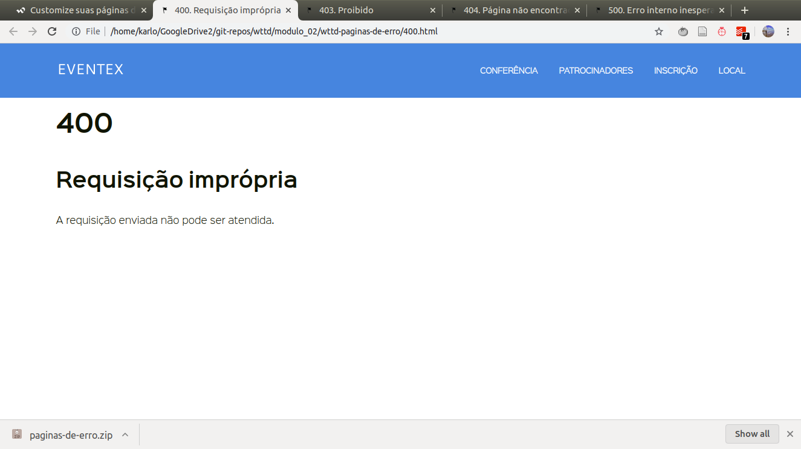
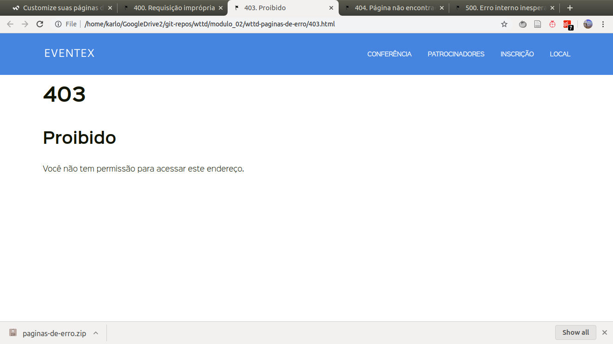
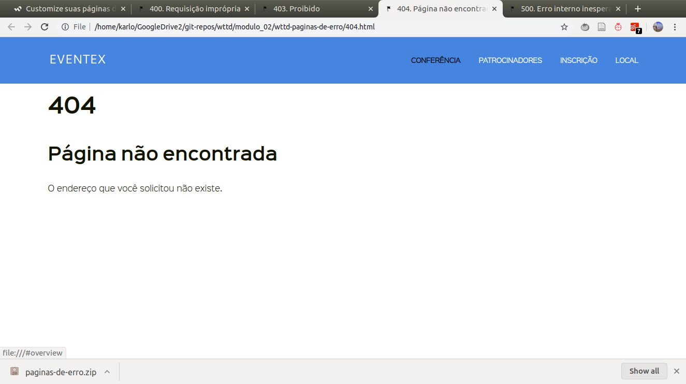
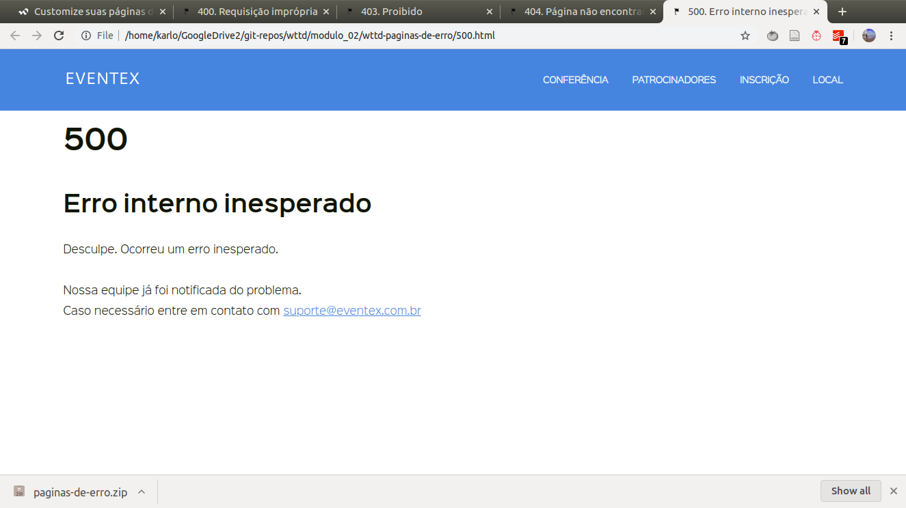
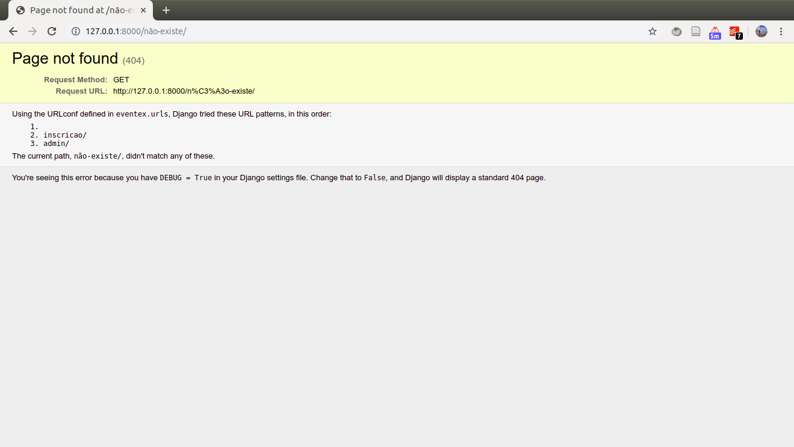
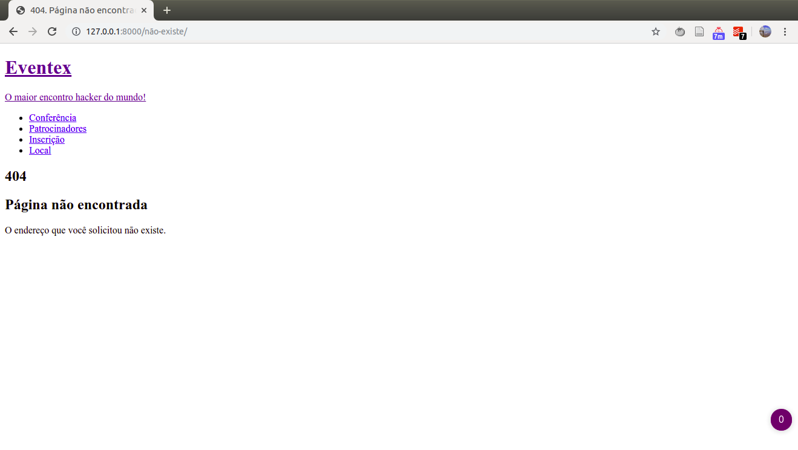

# M2A14: Customize suas páginas de erro - https://welcometothedjango.com.br/?post_type=aula&p=1110

Download dos templates das páginas de erro.

```bash
wget https://welcometothedjango.com.br/wp-content/uploads/2015/12/paginas-de-erro.zip -O modulo_02/paginas-de-erro.zip
cd modulo_02
unzip paginas-de-erro.zip
```

Vericando os arquivos `html`:









Esses arquivos serão movidos para `my_project/eventex/core/templates/`. O dajngo vai buscar automaticamente essas páginas caso algum erro aconteça. Uma vez movidos, já é possível acessá-los:

```python
manage runserver
```

Ao acessar uma página que não existe: http://127.0.0.1:8000/n%C3%A3o-existe/



Como a página informa, é necessário usar `DEBUG=False`.

```python
DEBUG=False manage runserver
```



Como informado no terminal, o django não está conseguindo acessar os estilos da página.

```
Performing system checks...

System check identified no issues (0 silenced).

You have 17 unapplied migration(s). Your project may not work properly until you apply the migrations for app(s): admin, auth, contenttypes, sessions.
Run 'python manage.py migrate' to apply them.

November 02, 2019 - 00:17:03
Django version 2.2.4, using settings 'eventex.settings'
Starting development server at http://127.0.0.1:8000/
Quit the server with CONTROL-C.
[02/Nov/2019 00:17:05] "GET /n%C3%A3o-existe/ HTTP/1.1" 404 2207
[02/Nov/2019 00:17:06] "GET /n%C3%A3o-existe/css/font-awesome.min.css HTTP/1.1" 404 2207
[02/Nov/2019 00:17:06] "GET /n%C3%A3o-existe/css/basalstyle/style.min.css HTTP/1.1" 404 2207
[02/Nov/2019 00:17:06] "GET /n%C3%A3o-existe/css/main.css HTTP/1.1" 404 2207
[02/Nov/2019 00:17:06] "GET /n%C3%A3o-existe/css/font-awesome.min.css HTTP/1.1" 404 2207
[02/Nov/2019 00:17:07] "GET /n%C3%A3o-existe/img/favicon.ico HTTP/1.1" 404 2207
```

Para isso, será necessário usar as notações do django como já foi feito para o `index.html`. Os seguintes trechos serão substituídos:

```html
<!-- Favicon -->
<link rel="shortcut icon" href="img/favicon.ico">

<!-- CSS -->
<link rel="stylesheet" href="css/font-awesome.min.css">
<link rel="stylesheet" href="css/basalstyle/style.min.css">
<link rel="stylesheet" href="css/main.css">
```

Tornando-se (lembrando da inclusão do `` logo no início do arquivo):

```html


<!-- Favicon -->
<link rel="shortcut icon" href="">

<!-- CSS -->
<link rel="stylesheet" href="">
<link rel="stylesheet" href="">
<link rel="stylesheet" href="">
```

Ao retornar a página no browser:


É necessário o `collect static`.

```bash
manage collectstatic
```

Testando o `runserver` novamente:

```bash
DEBUG=False manage runserver
```

Ao acessar http://127.0.0.1:8000/n%C3%A3o-existe/:


Agora é preciso aplicar essas modificações às outras páginas e commitar as modificações:

```bash
git status
```

Adicionando as modificações:

```bash
git add eventex/core/templates/
```

Conferindo:

```bash
git status
```

Commitando:

```bash
git commit -m "Customiza páginas de erro"
```

Enviando pro heroku:

```bash
git push heroku master --force
```

Enviando modificações para o github:

```bash
git push origin master
```
